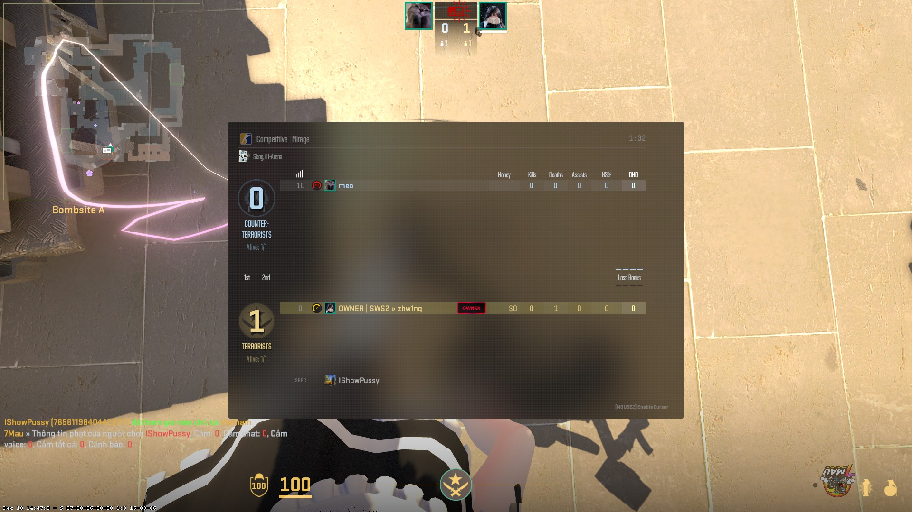

<div align="center">
  
  <h1>SwiftlyS2 FaceIT Scoreboard</h1>
  <p>Display FaceIT skill levels on the CS2 scoreboard</p>
</div>

<p align="center">
  <a href="https://developer.valvesoftware.com/wiki/Source_2"></a>
  <a href="https://github.com/zhw1nq/swiftlyS2-faceit-scoreboard/releases"></a>
  <a href="https://dotnet.microsoft.com/"></a>
</p>

---

## Showcase

<div align="center">
  
</div>

---

## Platform Support

| Platform | Status                                                                                       |
| -------- | -------------------------------------------------------------------------------------------- |
| Windows  | Tested                                                                                       |
| Linux    | Need testers - [Open an issue](https://github.com/zhw1nq/swiftlyS2-faceit-scoreboard/issues) |

## Requirements

- [SwiftlyS2](https://github.com/swiftly-solution/swiftlys2) v1.0.0+
- [FaceIT API Key](https://developers.faceit.com/)

## Installation

1. Download the [latest release](https://github.com/zhw1nq/swiftlyS2-faceit-scoreboard/releases)
2. Extract plugin to `addons/swiftlys2/plugins/swiftlyS2-faceit-scoreboard/`
3. Extract `workshop.zip` to `game/csgo_addons/` (not `content/csgo_addons/`)
4. Restart the server
5. Configure `config.jsonc` with your FaceIT API key

## Configuration

| Option                    | Type   | Default | Description                            |
| ------------------------- | ------ | ------- | -------------------------------------- |
| `ApiKey`                  | string | `""`    | FaceIT API key (Required)              |
| `UseCSGO`                 | bool   | `false` | Fallback to CSGO data if CS2 not found |
| `DefaultStatus`           | bool   | `true`  | Show level by default for new players  |
| `EnableToggleCommand`     | bool   | `true`  | Allow players to toggle display        |
| `CacheExpiryHours`        | int    | `24`    | Hours before refreshing level          |
| `MaxConcurrentRequests`   | int    | `3`     | Max concurrent API requests            |
| `RequestTimeoutSeconds`   | int    | `8`     | API request timeout                    |
| `AutoSaveIntervalSeconds` | int    | `120`   | Auto-save cache interval (0 = disable) |

## Commands

| Command   | Description                 |
| --------- | --------------------------- |
| `!faceit` | Toggle FaceIT level display |
| `!fl`     | Alias for `!faceit`         |

## Supported Languages

<p align="center">
  
  
  
  
  
  
  
  
  
  
  
  
  
  
  
  
  
  
  
  
  
  
  
  
  
  
  
  
  
  
</p>

## Building from Source

### Requirements

- [.NET 10.0 SDK](https://dotnet.microsoft.com/download/dotnet/10.0)
- [SwiftlyS2.CS2 NuGet Package](https://www.nuget.org/packages/SwiftlyS2.CS2)

### Build

```bash
git clone https://github.com/zhw1nq/swiftlyS2-faceit-scoreboard.git
cd swiftlyS2-faceit-scoreboard
dotnet restore
dotnet build
```

### Publish

```bash
dotnet publish -c Release
```

Output directory: `build/publish/swiftlyS2-faceit-scoreboard/`

## Credits

- **zhw1nq** - Author
- [Pisex](https://github.com/Pisex/cs2-faceit-level) - Original idea
- [SwiftlyS2](https://github.com/swiftly-solution/swiftlys2) - Framework
- [FaceIT](https://developers.faceit.com/) - API

## License

This project is licensed under the MIT License.
